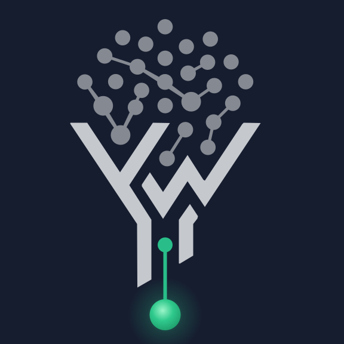
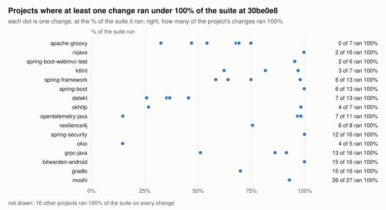
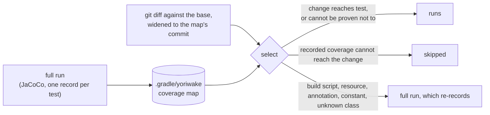
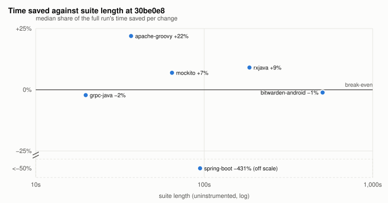

<p align="center">
  
</p>

<h1 align="center">yoriwake</h1>

<p align="center">
  <a href="https://plugins.gradle.org/plugin/io.github.zeuspizza.yoriwake"></a>
  <a href="LICENSE"></a>
  <a href="https://github.com/zeuspizza/yoriwake/actions/workflows/verify.yml"></a>
</p>

<p align="center">
  Runs the tests a change can reach, from per-test coverage, and sets the rest aside.<br>
  A Gradle plugin. Local, no service, and it would rather run everything than guess.
</p>

<picture>
  <source media="(prefers-color-scheme: dark)" srcset="docs/images/selected-share-dark.svg">
  
</picture>

<p align="center"><sub>
  Share of the suite each change ran: 426 changes in 32 projects from 27 codebases, at
  <code>30be0e8</code>. Each dot is a change that ran less than 100% of the suite, placed at the % of its tests it ran; the count on the right is the changes that ran 100%. 357 of the 426 ran 100% of the suite; 69 ran
  less than 100%, and the median of those ran 95% of it. 16 of the 32 projects narrowed at least
  one change. Tests, not seconds; see <a href="docs/benchmarks.md">the methodology</a>.
</sub></p>

```kotlin
plugins {
    java
    jacoco
    id("io.github.zeuspizza.yoriwake") version "0.1.0"
}
```

**yoriwake** (選り分け, *yo-ri-wa-ke*) is Japanese for sorting out: picking what you need from the
rest.

In the 0.1.0 sweep it skipped **0** of 471 failures a deliberate bug caused, across the 35 changes
where skipping one was possible (14 projects from 12 codebases). Another 214 changes were forced to
the whole suite because it could not prove a narrower run safe. A sample of generated edits, not a
proof: [how that was measured, and what it cannot see](docs/benchmarks.md#recall).

## Quickstart

Apply the plugin as above. The `jacoco` plugin is required; yoriwake scopes it.

```bash
./gradlew test                      # runs everything and records a coverage map
./gradlew yoriwakeAuditTest         # what selection could do on this suite, before trusting it
./gradlew test -Pyoriwake.select    # runs only the tests the change reaches
```

Ask the audit first. It reads the map, runs no tests, and reports how much of the suite a change to
one class reaches, which classes are reached so widely that touching one runs everything, and every
blocker it can establish, each with its remedy or a plain "no remedy". Most of its answers are
refusals rather than low numbers; it is built to tell you not to bother.

Without `-Pyoriwake.select` nothing is ever skipped. A selecting run says what it decided:

```
[yoriwake] :test selecting against 6aa07c0 (merge base with the branch upstream): 1 changed classes, 0 paths coverage cannot see
[yoriwake] of 593 tests discovered: reaches-change=47 not-known-to-pass=5 skipped=541
```

`.gradle/yoriwake/<task>-<hash>/decisions.tsv` holds one row per test with its verdict and the
rule that decided it. `yoriwakeExplainTest` answers for the change in front of you: what would run,
and which class forces a full run if one does.

## How it works



- **Record.** A run of the whole suite records which classes each test executed, plus what its test
  JVM loaded, read or initialised once for every later test. Plain text, outside `build/`.
- **Select.** With `-Pyoriwake.select`, the change set is the diff against the merge base, widened
  back to the commit the map was recorded at. A JUnit Platform filter skips each test whose record
  cannot reach it; a test the map has never seen, or never saw pass, always runs.
- **Refuse.** Anything coverage cannot see, such as a build script, a resource, an annotation or a
  changed constant, runs everything and says why.
  [The full list](docs/reference.md#when-it-refuses-to-select).

## Where it pays

<picture>
  <source media="(prefers-color-scheme: dark)" srcset="docs/images/time-saved-dark.svg">
  
</picture>

<p><sub>
  Median share of the full run's wall clock saved per change, on the 6 projects where both runs
  were timed on every change. Below the line, selection cost more than it saved; spring-boot sits
  below a break in the axis, its value written beside it.
  Paired on one machine, minutes apart; the seconds do not travel to yours.
</sub></p>

| project | tests | full run | tests run per change (median) | time saved per change (median) | changes |
|---|---:|---:|---:|---:|---:|
| grpc-java | 1,536 | 6.5 s | 1,536 (100%) | −2% | 16 (8 forced) |
| apache-groovy | 1,102 | 27.1 s | 747 (68%) | +22% | 7 (0 forced) |
| mockito | 2,356 | 48.6 s | 2,356 (100%) | +7% | 16 (4 forced) |
| spring-boot | 3,682 | 92.7 s | 3,672 (99.7%) | −431% | 13 (2 forced) |
| rxjava | 13,921 | 177.6 s | 13,847 (99.5%) | +9% | 16 (2 forced) |
| bitwarden-android | 7,341 | 591.3 s | 7,341 (100%) | −1% | 16 (9 forced) |

"Full run" is the median full arm of the measured changes, not the suite length on the chart's
x-axis. mockito ran every test on every change and still read +7%, so a difference of that size is
not evidence of a saving; only apache-groovy's is clearly larger. spring-boot's selecting runs
spent a median 404 s configuring the plugin, over four times its full run: the sweep's plugin
re-read the working tree's untracked and ignored files once per test task, and spring-boot has 527
test tasks and about 250,000 such files. Every other timing project spent under a second there.
The released plugin lists the tree once per build and selects the same tests; every time on this
page still describes the sweep's plugin ([why](docs/benchmarks.md#the-released-plugin)).

A share of the suite is not a share of the time. Gradle configuration, compilation and JVM start
do not shrink, and the run that records the map pays from nothing measurable to +140% over an
uninstrumented one across 32 projects (median +16%, one recording each), driven by how expensive
the build is to configure more than by how long its tests take. Before adopting, measure your own:
`./gradlew yoriwakeAuditTest -Pyoriwake.audit.measureToll` with the two timings
[`scripts/measure-toll.sh`](scripts/measure-toll.sh) takes.
[Every figure and its caveats](docs/benchmarks.md).

## Who it is for

- An AI agent's or a developer's edit-test loop, on a suite that takes more than a couple of
  minutes.
- Pull-request CI, with the full suite still running after merge, nightly or before a release.

It is not a better version of Develocity Predictive Test Selection, which is a hosted service that
learns from build history. This one is local, free, and decides from recorded coverage.

## When not to use it

Read these before anything else. [The reference](docs/reference.md#what-is-not-supported) has the
details of each.

- **When a missed failure is unaffordable without a later full run.** It skips a test that would
  have failed when the dependency is one it cannot see: state another process, a database, the
  network or a file keeps between test JVMs; a reviewed native library handed a class file's path
  as data; the JDK's class-loading internals called by reflection; a dependency jar naming one of
  your test classes; your own code on the test JVM's boot class path or in a JDK module it patches
  or upgrades; a file a build step generates from git state or the clock; an edited test class
  JaCoCo could not instrument (Gradle 8.14 with tests on JDK 26 or later, or a method too large
  once instrumented). Keep a full run after merge or nightly.
- **Order-dependent tests.** Selection changes which tests run together. Pin the ones you know
  with `@Tag("yoriwake-always-run")` or `yoriwake { alwaysRun.add(...) }`.
- **Very large builds pay a git listing per test task.** Each test task a selecting or recording
  run executes lists the untracked and ignored files with git: about 9 seconds on spring-boot, so
  minutes across hundreds of test tasks ([details](docs/reference.md#what-is-not-supported)).
- **Short suites.** The floor and the recording toll are fixed; below a couple of minutes it is
  usually slower, not faster.
- **Suites that run in one JVM and share setup.** A change to a class the JVM loaded early selects
  every later test in that JVM. [Recording each class in its own
  JVM](docs/reference.md#recording-each-test-class-in-its-own-jvm) narrows it, at several times the
  recording cost.
- **Without the JUnit Platform.** Plain JUnit 4 and TestNG are recorded but always run in full;
  JUnit 4 narrows only through the vintage engine. Kotest specs always run.
- **Coverage reports.** While yoriwake records, the test task's own JaCoCo `.exec` holds almost
  nothing, full runs included. Run coverage jobs with `-Pyoriwake.disabled=true`.
- **Windows.** It has never run there. Maps move between Linux and macOS.
- **A test filter in the build script.** A test filter set in the build script
  (`filter.include/excludeTestsMatching`) switches selection off for that task: every run is a full
  run, and the recording cost is still paid. The fix is planned for 0.2.
- **Builds it declines.** Gradle below 8.14 on a JDK 21 daemon, Isolated Projects, and JUnit
  in-JVM parallelism: every run is a full run, nothing is recorded, and the plugin says so. Below
  8.14 on an older daemon JDK the build fails to resolve the plugin instead.
- **Changes coverage cannot see.** Resources, build scripts and version catalogs run everything by
  design, and so does a Kotlin change in a build that emits no `SourceDebugExtension`. A file your
  tests write into the source tree outside `build/` counts as a change and forces every run.
- **After a revert following a `--tests` run** (IntelliJ's delegated runs), run once without
  `-Pyoriwake.select` to re-record.

Requirements: the Gradle daemon on JDK 21+, test JVMs on JDK 11+, Gradle 8.14+ (9.x included),
`git` on `PATH`, and a project applying `java`, an Android plugin, or Kotlin Multiplatform with a
JVM target (unverified). In CI, cache `.gradle/yoriwake` and fetch enough history to reach the
diff base; an old map costs speed, never safety. [The CI recipe](docs/reference.md#ci).

## Documentation

- [Reference](docs/reference.md): how it works, every property and task, what is not supported,
  upgrading, prior art
- [Contract](docs/contract.md): the properties and files the plugin and the agent share
- [Benchmarks](docs/benchmarks.md): the corpus, the method, and every figure on this page
- [Contributing](CONTRIBUTING.md): building, testing, what a change to selection must prove
- [Changelog](CHANGELOG.md): each release, and what it does to an existing map
- [Security](SECURITY.md): reporting a vulnerability

Apache-2.0, see [LICENSE](LICENSE); [NOTICE](NOTICE) lists what is shaded into the jars.
